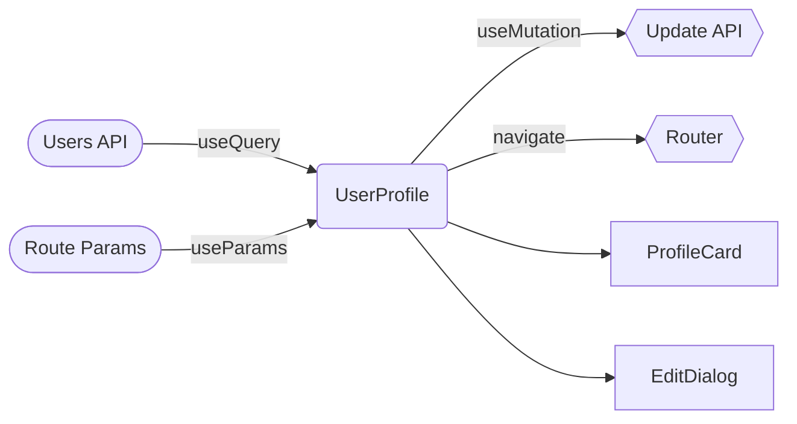

# Visualize React Component

Generate a rendered Mermaid diagram that visualizes how data flows through a React component.

## What to Analyze

Read the target component file and identify:

1. **Data Sources** — where the component gets its data:
   - API queries (`useQuery`, `useSuspenseQuery`, query options)
   - Route parameters (`useParams`, `useSearch`, loader data)
   - Props passed from parent components
   - Context consumers (`useContext`, custom context hooks)
   - Electron IPC calls (`window.electronAPI.*`)
   - Local state (`useState` initial values, derived state)

2. **Data Destinations** — where the component sends data:
   - API mutations (`useMutation`, POST/PUT/DELETE calls)
   - Electron IPC calls that write or trigger actions
   - Navigation (`useNavigate`, `router.navigate`, `Link` with params)
   - Context providers (data passed down via context)
   - Callback props invoked with data

3. **Rendered Children** — key UI elements the component outputs:
   - Named child components (not generic primitives like `
`)
   - Conditional rendering branches (what determines which UI shows)
   - Dialogs, modals, or overlays triggered by state

## Diagram Structure

Build a Mermaid flowchart with these sections:

- **Left column**: Data sources flowing into the component
- **Center**: The component itself
- **Right column**: Data destinations the component writes to
- **Below**: Key rendered children

Use this consistent style:
- Data sources use stadium shape: `([Source Name])`
- The component uses a rounded box: `(Component Name)`
- Data destinations use hexagon shape: `{{Destination Name}}`
- Rendered children use standard boxes: `[Child Name]`
- Label edges with the hook or mechanism used (e.g., `useQuery`, `useMutation`, `props`)

## Output

Use the Mermaid MCP tool (`mcp__mermaid__validate_and_render_mermaid_diagram`) to render the diagram. Do not output raw Mermaid source code — always render it.

After rendering, provide a brief summary (2-3 sentences) of the component's data flow.

## Example

For a component that fetches user data, submits a form, and renders a profile card:

