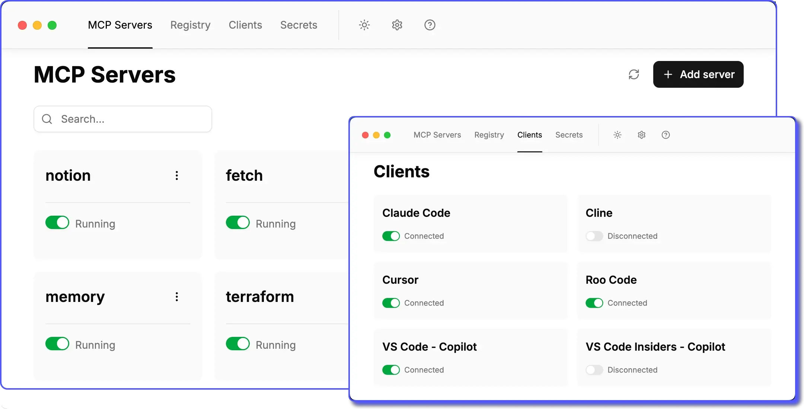

<picture>
  <source media="(prefers-color-scheme: dark)" srcset="docs/images/toolhive-byline-white.svg">
  
</picture>

 

[![Release][release-img]][release] [![Build status][ci-img]][ci]
[![Coverage Status][coverage-img]][coverage]
[![License: Apache 2.0][license-img]][license]
[![Discord][discord-img]][discord]

# ToolHive Desktop UI

> [!NOTE] This is an experimental project that is under active development and
> testing. Features may change without notice.

**Run any Model Context Protocol (MCP) server — securely, instantly, anywhere.**

ToolHive is the easiest way to discover, deploy, and manage MCP servers. Launch
any MCP server in a locked-down container with just a few clicks. No manual
setup, no security headaches, no runtime hassles.

<picture>
  <source media="(prefers-color-scheme: dark)" srcset="./docs/images/toolhive-ui-screenshot-dark.webp">
  
</picture>

## Quick links

- 🚀 [Quickstart](https://docs.stacklok.com/toolhive/tutorials/quickstart-ui) -
  install ToolHive and run your first MCP server
- 📚 [Documentation](https://docs.stacklok.com/toolhive/) - learn more about
  ToolHive's features
- 💬 [Discord community](https://discord.gg/stacklok) - connect with the
  ToolHive community, ask questions, and share your experiences
- 🛠️ [Developer guide](./docs/README.md) - build, test, and contribute to the
  ToolHive UI

---

<table>
<tr>
<td width="50%">

## Why ToolHive?

- **Instant deployment:** Start any MCP server with a simple graphical workflow.
- **Secure by default:** Every server runs in an isolated container with only
  the permissions it needs. Secrets are managed securely, never in plaintext.
- **Works everywhere:** Runs on Windows, macOS, or Linux.
- **Seamless integration:** ToolHive auto-configures popular clients like GitHub
  Copilot, Cursor, Claude Code, and more.

 
</td>
<td width="50%" align="center">
  <picture>
    <source media="(prefers-color-scheme: dark)" srcset="docs/images/toolhive-sources-dark.svg">
    
  </picture>
</td>
</tr>
</table>

---

## Getting started

To get started with ToolHive, download the latest release from
[the website](https://toolhive.dev/download/) and follow the
[quickstart guide](https://docs.stacklok.com/toolhive/tutorials/quickstart-ui).

---

## How it works

Under the hood, ToolHive runs each MCP server in its own secure container and
exposes an HTTP/SSE proxy that MCP clients connect to.

<picture>
  <source media="(prefers-color-scheme: dark)" srcset="docs/images/toolhive-diagram-dark.svg">
  
</picture>

For more advanced use cases, ToolHive is also available as a command-line tool
which can be used standalone or side-by-side with the ToolHive UI and as a
Kubernetes Operator. Learn more in the
[ToolHive documentation](https://docs.stacklok.com/toolhive/).

---

## Privacy and telemetry

ToolHive uses [Sentry](https://sentry.io/) for error tracking and performance
monitoring to help us identify and fix issues, improve stability, and enhance
the user experience. This telemetry is enabled by default but completely
optional.

### What data is collected?

- Error reports and crash logs
- Performance metrics
- Usage patterns

### How to opt out

You can easily disable telemetry at any time:

1. Open ToolHive
2. Go to **Settings** (gear icon in the top navigation)
3. Find the **Telemetry** section
4. Toggle off telemetry collection

---

<table><tr><td>

## Contributing

We welcome contributions and feedback from the community!

- 🐛 [Report issues](https://github.com/stacklok/toolhive-studio/issues)
- 💬 [Join our Discord](https://discord.gg/stacklok)
- 🤝 [Contributing guide](./CONTRIBUTING.md)
- 🛠️ [Developer guide](./docs/README.md)

If you have ideas, suggestions, or want to get involved, check out our
contributing guide or open an issue. Join us in making ToolHive even better!

</td>
<td>

<picture>
  
</picture>

</td></tr></table>

---

## License

This project is licensed under the [Apache 2.0 License](./LICENSE).

<!-- Badge links -->
<!-- prettier-ignore-start -->
[release-img]: https://img.shields.io/github/v/release/stacklok/toolhive-studio?style=flat&label=Latest%20version
[release]: https://github.com/stacklok/toolhive-studio/releases/latest
[ci-img]: https://img.shields.io/github/actions/workflow/status/stacklok/toolhive-studio/on-main.yml?style=flat&logo=github&label=Build
[ci]: https://github.com/stacklok/toolhive-studio/actions/workflows/on-main.yml
[coverage-img]: https://coveralls.io/repos/github/stacklok/toolhive-studio/badge.svg?branch=main
[coverage]: https://coveralls.io/github/stacklok/toolhive-studio?branch=main
[license-img]: https://img.shields.io/badge/License-Apache2.0-blue.svg?style=flat
[license]: https://opensource.org/licenses/Apache-2.0
[discord-img]: https://img.shields.io/discord/1184987096302239844?style=flat&logo=discord&logoColor=white&label=Discord
[discord]: https://discord.gg/stacklok
<!-- prettier-ignore-end -->

<!-- markdownlint-disable-file first-line-heading no-inline-html -->
