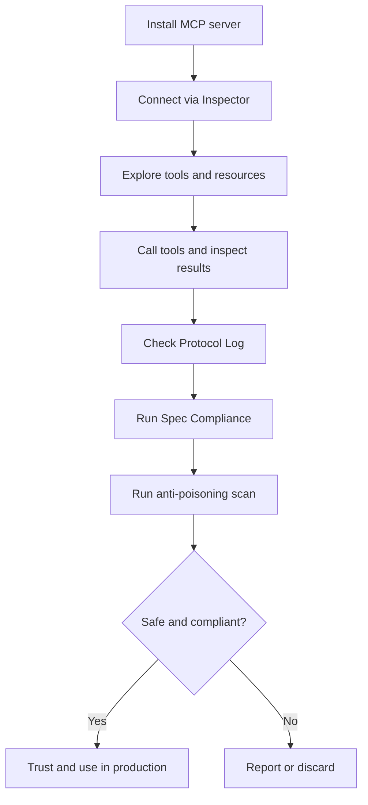
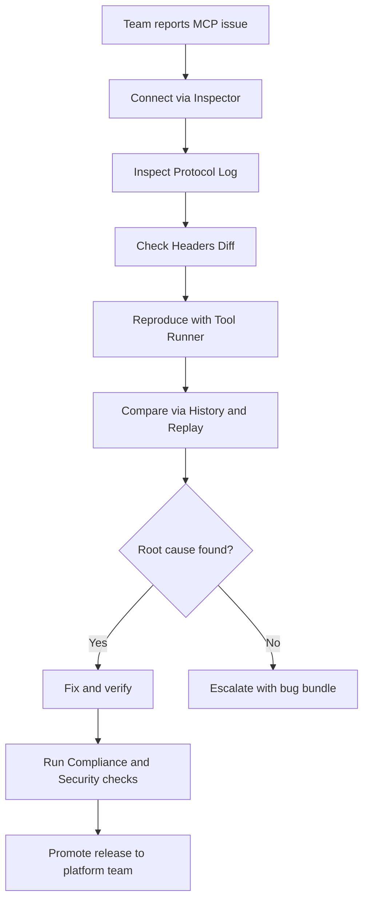
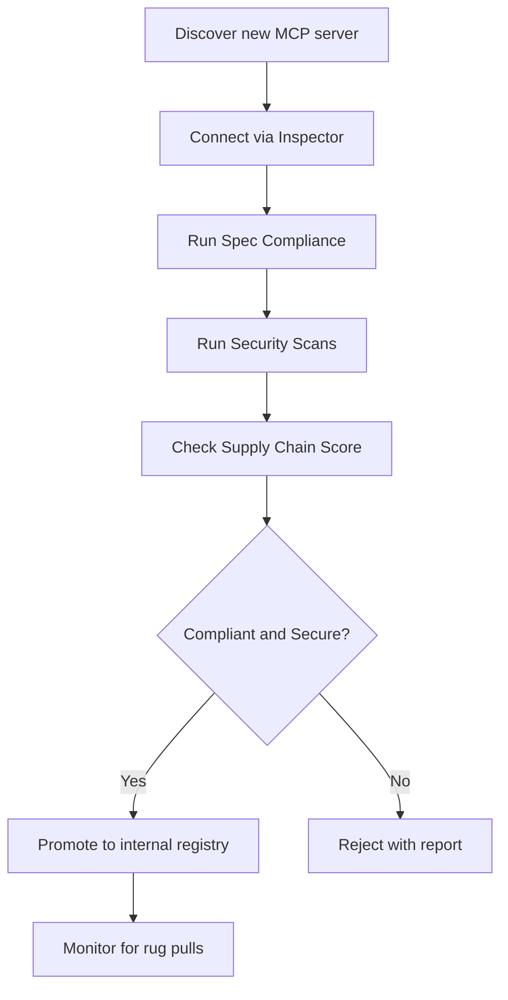
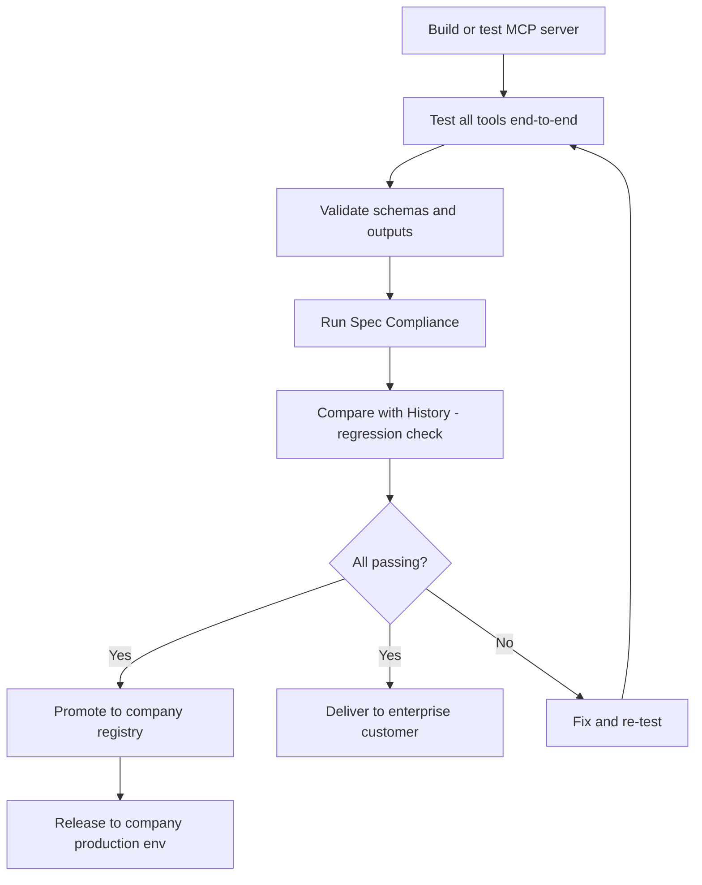

# ToolHive MCP Inspector — Requirements v2 (Research-Based)

> **Research conducted on:** GitHub Issues/Discussions (modelcontextprotocol/inspector, /modelcontextprotocol, /python-sdk, /go-sdk, /servers, /typescript-sdk, anthropics/claude-code), CVE database (NVD, GHSA), security research (Oligo, Tenable, Invariant Labs, Snyk, JFrog, Palo Alto Unit 42, Check Point, Straiker, Adversa AI), OWASP MCP Top 10, Substack (mcpincontext), Reddit (r/ClaudeAI, r/LocalLLaMA, r/artificial), X/Twitter (developer sentiment), technical blog posts (Docker, Microsoft, Cisco, WorkOS, Auth0, Equixly, Astrix, AuthZed, Specmatic, Stainless, Red Hat, Trend Micro), MCP spec changelogs (2025-06-18, 2025-11-25, draft 2026), third-party tools (30+ analyzed).
>
> **UI Mockup:** [`inspector-mockup.html`](./inspector-mockup.html) — interactive HTML prototype of the inspector (dark theme, Discovery, Tool Runner, Protocol Log, Compliance panels).

---

## Context: Why an Inspector inside ToolHive

MCP debugging is described by the community as "a frustrating exercise in blind debugging" (WorkOS MCP Night 2.0). Recurring problems:

- **Opaque errors**: "Connection Error" with no diagnostics (inspector#384, 10+ thumbs up)
- **"Works in stdio, breaks in HTTP"**: the #1 pattern in the ecosystem
- **OAuth chaos**: 11+ open issues on the official inspector alone, called "barely functional" (Cra.mr)
- **Silent failures**: when MCP servers break, the AI model hallucinates instead of showing stack traces
- **Context window bloat**: 10 servers with 212 tools = ~164K tokens, 82% of Claude's context (Medium, Jan 2026)
- **Security**: 43% of tested MCP implementations contain command injection (audit Mar 2025)
- **"95% of MCP servers are utter garbage"** (Reddit r/MCP, cited in StackOne, WorkOS, and others)

ToolHive has a unique advantage: MCP servers already run in isolated containers. The inspector can leverage this to offer security, observability and debugging that no other tool can provide.

---

## Document Structure

The document separates **Inspector Core** (what every MCP inspector must do — connect, discover, execute, log) from **Product Features** (why someone would choose ToolHive over the official inspector).

- **Inspector Core**: functional baseline. What the official Inspector, MCPJam, and Postman MCP already do.
- **Product: Diagnostics**: intelligent diagnostics, automatic health checks, compliance.
- **Product: Security**: scanning, rug pull detection, supply chain scoring — the container runtime advantage.

---

## Priority (P0 / P1 / P2)

| Priority | # | Feature | Rationale |
|----------|---|---------|-----------|
| **P0** | 1 | Connectivity — connect via stdio, SSE, streamable-http with auto-detection | Inspector doesn't work without it |
| **P0** | 2 | Discovery — list tools, resources, prompts with JSON Schema viewer | Core function |
| **P0** | 3 | Tool Call Runner — auto-generated form from schema, raw mode for invalid inputs | Core function |
| **P0** | 4 | Protocol Log — bidirectional JSON-RPC log with credential redaction | Core debugging |
| **P0** | 6 | Custom Headers + Diff — pass auth headers through proxy, show where they get lost | Can't connect to authenticated MCP servers without it |
| **P0** | 11 | Spec Compliance Checker — validate MCP spec conformance, pass/fail report | Compliance differentiator |
| **P0** | 14 | Tool Description Scanner — detect prompt injection, poisoning, suspicious patterns | Security differentiator |
| **P1** | 5 | Mcp-Session-Id tracking — ensure session-id on all requests, highlight when missing | Spec compliance, simple to implement |
| **P1** | 8 | Structured Content viewer — render JSON, images, audio, diff vs outputSchema | Applied-AI needs it |
| **P1** | 9 | History + Replay — chronological action log with one-click replay | Regression detection |
| **P1** | 12 | list_changed + Auto-refresh — react to tool/resource/prompt changes in real time | Dev experience applied-ai |
| **P1** | 15 | Capabilities Diff — snapshot tools at discovery, alert on changes between sessions | Security differentiator |
| **P1** | 16 | Supply Chain Scoring — SBOM, CVE check, trust score per server | Enterprise + applied-ai |
| **P2** | 7 | Streamable HTTP fallback — correlate POST/GET SSE, reconnect with Last-Event-ID | Edge case |
| **P2** | 10 | Cancellation support — cancel button for long-running tool calls | Nice to have |
| **P2** | 13 | Progress vs Timeout — explain why a tool was killed despite sending progress | Niche, applied-ai only |

**Summary**: P0 = 7 features (inspector works and differentiates on compliance + security). P1 = 6 features (enterprise + applied-ai value). P2 = 3 features (polish and edge cases).

---

## Inspector Core

> Baseline capabilities that every MCP inspector must have. Without these, the inspector is not usable. These correspond to what the official Inspector, MCPJam (notably their [OAuth Debugger](https://github.com/MCPJam/inspector?tab=readme-ov-file#oauth-debugger)), and Postman MCP offer.

| # | Feature | Description | Key Evidence |
|---|---------|-------------|--------------|
| 1 | **Connectivity (stdio / SSE / streamable-http)** | Supports all three MCP transports. User chooses type (stdio = command, SSE/streamable-http = URL). For HTTP transports, auto-detection: tries POST for streamable-http, falls back to GET for legacy SSE. Verifies endpoint, explains common errors (405 on GET = normal for streamable-http, SSE stream failure, session-id missing). Shows real-time diagnostic checklist with verbose error messages. | Inspector [#384](https://github.com/modelcontextprotocol/inspector/issues/384) (10+ thumbs up): "Connection Error" with no diagnostics. Claude Code [#18127](https://github.com/anthropics/claude-code/issues/18127): useless error message. |
| 2 | **Discovery: Tools / Resources / Prompts + schema viewer** | Lists everything with navigable JSON schema, annotations (readOnlyHint, destructiveHint, openWorldHint, idempotentHint), outputSchema, and icons (spec 2025-11-25). Full JSON Schema 2020-12 support. | Inspector [#445](https://github.com/modelcontextprotocol/inspector/issues/445)/$defs and [#496](https://github.com/modelcontextprotocol/inspector/issues/496)/allOf-oneOf not supported. Spec [#834](https://github.com/modelcontextprotocol/modelcontextprotocol/issues/834) (10 reactions): JSON Schema 2020-12. |
| 3 | **Tool Call Runner (JSON editor + validation)** | Auto-generated form from input schema with full $defs/allOf/oneOf/anyOf support. Client-side validation. "Raw" mode for intentionally testing invalid inputs. Result/error viewer with structured vs unstructured diff. | Inspector [#888](https://github.com/modelcontextprotocol/inspector/issues/888): needs debug mode to bypass validation. |
| 4 | **Protocol Log (bidirectional JSON-RPC)** | Complete request/response/notification log with timing, session-id, transport type, progress tracking. Exportable as "bug bundle" (JSON + metadata). Filterable by type, server, error. **Credential redaction**: tokens, Bearer tokens, client secrets and API keys are automatically masked in all logs and views (never plaintext). | Inspector [#384](https://github.com/modelcontextprotocol/inspector/issues/384): "does not emit any error logs other than Connection Error." |
| 5 | **Mcp-Session-Id tracking (spec-compliant)** | Ensures session-id is sent on ALL requests after init. Highlights when missing. Supports session persistence for horizontal scaling. | Inspector [#905](https://github.com/modelcontextprotocol/inspector/issues/905): violates the spec. Python-SDK [#880](https://github.com/modelcontextprotocol/python-sdk/issues/880) (22 reactions): sessions lost behind load balancer. |
| 6 | **Custom Headers passthrough + Headers Diff** | Custom headers (Authorization, X-API-Key) passed THROUGH the proxy to the server. Supports headers from CLI and UI. **Headers Diff view**: comparison between user-configured headers and headers actually sent to the server. On 401/403, the Protocol Log highlights if a configured header was not sent (pattern "header silently dropped"). With the ToolHive gateway, shows **at which hop** the header is lost (Client → Proxy → Gateway → Server). | Inspector [#879](https://github.com/modelcontextprotocol/inspector/issues/879): "headers authenticate TO the proxy, not THROUGH to the server." TS-SDK [#436](https://github.com/modelcontextprotocol/typescript-sdk/issues/436) (9 reactions): SSE client silently drops custom headers. |
| 7 | **Streamable HTTP: GET SSE fallback + reconnect** | Correlates responses from POST SSE and GET SSE stream. Reconnect with Last-Event-ID header. Supports distributed servers behind load balancer. | Inspector [#614](https://github.com/modelcontextprotocol/inspector/issues/614): timeout instead of correlating GET SSE. Inspector [#920](https://github.com/modelcontextprotocol/inspector/issues/920): doesn't send Last-Event-ID on reconnect. |
| 8 | **Structured Content viewer** | Rendering for structuredContent (navigable JSON, MIME types for images/audio/files) + diff between declared outputSchema and actual output. | Spec 2025-06-18: structured content + outputSchema. Inspector [#763](https://github.com/modelcontextprotocol/inspector/issues/763). |
| 9 | **History + Replay** | Chronological log of every action (tool call, resource read, prompt get) with timestamp, server, method, latency, status. One-click replay. Filterable by server, method, error. | Common pattern: "it worked yesterday, broken today" with no way to compare. MCPcat offers session replay for production. |
| 10 | **Cancellation support** | UI button to cancel long-running operations via cancellation notification. Progress bar from progress notifications. | Inspector [#591](https://github.com/modelcontextprotocol/inspector/issues/591) (7 reactions): no UI to cancel. |

---

## Product: Diagnostics

> Intelligent diagnostics that activate automatically. The inspector collects data in the background (Protocol Log, headers, timestamps) and when something breaks, it already has the context to explain **why**. No competing inspector offers this level of diagnostics.

| # | Feature | Description | Key Evidence |
|---|---------|-------------|--------------|
| 11 | **Spec Compliance Checker** | Automatically validates that the server respects the MCP spec: correct error codes, notification handling, initialization sequence, capabilities declaration. Pass/fail report per spec version. Can integrate [modelcontextprotocol/conformance](https://github.com/modelcontextprotocol/conformance) (official, v0.1.14, TypeScript), [Janix MCP Validator](https://github.com/Janix-ai/mcp-protocol-validator) (73 stars, multi-version), or [mcp-tester](https://lib.rs/crates/mcp-tester) (Rust, CLI). | Spec [#1627](https://github.com/modelcontextprotocol/modelcontextprotocol/issues/1627) (5 reactions): SEP-1627 proposes conformance testing. |
| 12 | **list_changed + Auto-refresh** | Automatically reacts to notifications/tools/list_changed, notifications/resources/list_changed, notifications/prompts/list_changed. Shows diff in real time. | Inspector [#378](https://github.com/modelcontextprotocol/inspector/issues/378) (5 reactions): list_changed received but UI doesn't update. Critical for Applied-AI: during development, tools change constantly and developers need to see updates live without reconnecting. |
| 13 | **Progress vs Timeout Correlation** | When a tool call times out, checks if the server was sending progress notifications. If so, explains that the client doesn't reset the timeout on progress and suggests `resetTimeoutOnProgress`. | TS-SDK [#192](https://github.com/modelcontextprotocol/typescript-sdk/issues/192) (5 reactions): `resetTimeoutOnProgress` defaults to `false`. Long-running tool killed by timeout despite active progress. |

> **How they work**: diagnostics checks activate automatically at connection, with no user action. Data comes from the Protocol Log (#4) and Connectivity (#1). When something breaks, the inspector already has the context to explain **why**.

### Spec Compliance: Sequence diagram

```mermaid
sequenceDiagram
    participant UI as Inspector UI
    participant CR as Conformance Runner
    participant S as MCP Server

    UI->>CR: Run compliance (server URL)

    rect rgb(30, 40, 50)
    note right of CR: 1. Lifecycle
    CR->>S: initialize (protocolVersion, clientInfo)
    S-->>CR: (protocolVersion, serverInfo, capabilities)
    CR->>CR: PASS - Verify response structure
    CR->>S: notifications/initialized
    end

    rect rgb(30, 40, 50)
    note right of CR: 2. Discovery
    CR->>S: tools/list
    S-->>CR: tools with inputSchema
    CR->>CR: PASS - Valid JSON Schema, annotations
    CR->>S: resources/list
    S-->>CR: resources
    CR->>S: prompts/list
    S-->>CR: prompts
    end

    rect rgb(30, 40, 50)
    note right of CR: 3. Tool call scenarios
    CR->>S: tools/call (test_tool)
    S-->>CR: content with text
    CR->>CR: PASS - Verify content structure

    CR->>S: tools/call (test_error)
    S-->>CR: content with isError true
    CR->>CR: PASS - isError flag present
    end

    rect rgb(30, 40, 50)
    note right of CR: 4. Utilities
    CR->>S: ping
    S-->>CR: empty response
    CR->>S: logging/setLevel (info)
    S-->>CR: ok or -32601
    CR->>CR: PASS - Matches declared capabilities
    end

    CR->>UI: ConformanceCheck results
    UI->>UI: Render report Tier 1/2/3 pass/fail
```

---

## Product: Security

> ToolHive's unique advantage: MCP servers run in isolated containers. The inspector can verify not only what the server **says** it does (static analysis), but what it **actually does** (runtime analysis). No other inspector has this capability.
>
> **Reference tools for detection**: [Snyk agent-scan](https://github.com/snyk/agent-scan) (ex mcp-scan) — prompt injection, tool poisoning, rug pull via hash, data leak / destructive toxic flows. [Cisco MCP Scanner](https://github.com/cisco-ai-defense/mcp-scanner) — prompt injection, tool poisoning via customizable YARA rules, 100% local.

| # | Feature | Description | Key Evidence |
|---|---------|-------------|--------------|
| 14 | **Tool Description Scanner (anti-poisoning)** | Scans descriptions for: embedded instructions, external URLs, base64, prompt injection patterns, "ignore previous" patterns. Trust score + visual warning. Raw view to see exactly what the LLM receives. | Invariant Labs: WhatsApp exfiltration via tool poisoning. MCPTox benchmark: tool poisoning "alarmingly common" across 45 real servers. |
| 15 | **Capabilities Diff (snapshot + rug pull detection)** | Snapshot at first discovery. On every reconnect: diff of added/removed/modified tools (schema + description). Hash-based change detection. Alert on suspicious changes. | CVE-2025-54136 (MCPoison): config approved, then silently modified. mcp-scan: tool pinning via hash. |
| 16 | **Supply chain scoring** | Per server: SBOM (via [Trivy](https://github.com/aquasecurity/trivy) or [Syft](https://github.com/anchore/syft) + [Grype](https://github.com/anchore/grype)), CVE check, trust score (age, maintainer, signing, test coverage, permission scope). Integration with BlueRock Trust Registry. | GitGuardian: Smithery.ai supply chain compromise → 3000+ servers exposed. OWASP MCP04. |

Example of how the inspector shows scan results in the UI:

| Tool | Status | Detail |
|------|--------|--------|
| `sum` | ⚠️ Warning | Tool description contains suspicious patterns |
| `multiply` | ✗ Error | Prompt injection detected |
| `get_comments` | ✓ OK | |
| `get_api_key` | ✓ OK | |
| `send_email` | ⚠️ Warning | Data leak toxic flow: can exfiltrate data read by other tools |
| `delete_file` | ⚠️ Warning | Destructive toxic flow: combined with other tools can cause damage |

> **ToolHive advantage**: external scanners can only verify what the server **says** it does (static analysis of descriptions). ToolHive can verify what the server **actually does** (container runtime analysis): undeclared network calls, filesystem writes with `readOnlyHint: true`, silent description changes between sessions.

---

## Personas

### 1. OSS Developer

> Individual developer or hobbyist who installs MCP servers from the registry and wants to test them before trusting them with their data.

**Goal**: "I found an MCP server on GitHub. Does it work? Can I call its tools? Is it safe?"

**Key workflows**:
- Connect to a running MCP server and explore tools/resources/prompts
- Call tools with different inputs, inspect responses
- Check the Protocol Log to understand what's happening under the hood
- Run spec compliance to verify the server follows the MCP spec
- See if tool descriptions contain anything suspicious (anti-poisoning scan)

**Primary features**: #1 Connectivity, #2 Discovery, #3 Tool Call Runner, #4 Protocol Log, #11 Spec Compliance Checker, #14 Tool Description Scanner

---

### 2. Enterprise Developer / Security Team

> Developer or security engineer in an organization that manages an internal MCP server registry. Two main scenarios: debugging issues with MCP servers already in use, and evaluating new MCP servers before promoting them to the company-approved catalog.

**Use Case A — Debug an issue with an existing MCP server**

**Goal**: "Our team is hitting errors with an approved MCP server. What's going wrong?"

**Key workflows**:
- Connect to the problematic MCP server via the Inspector
- Inspect the Protocol Log to understand request/response flow
- Check headers diff to spot silently dropped auth headers
- Call specific tools to reproduce the issue
- Use History + Replay to compare working vs broken behavior

**Primary features**: #1 Connectivity, #3 Tool Call Runner, #4 Protocol Log, #6 Custom Headers + Diff, #9 History + Replay

**Use Case B — Evaluate and promote a new MCP server**

**Goal**: "We found a new MCP server. Is it spec-compliant? Is it secure? Can we add it to our internal registry?"

**Key workflows**:
- Connect to the MCP server and explore capabilities
- Run spec compliance checks against the MCP specification
- Scan tool descriptions for prompt injection, poisoning, suspicious patterns
- Evaluate supply chain trust (maintainer, CVEs, signing, SBOM)
- Generate compliance report and promote to the internal registry
- After approval: monitor capabilities diff to catch rug pulls

**Primary features**: #11 Spec Compliance Checker, #14 Tool Description Scanner, #15 Capabilities Diff, #16 Supply Chain Scoring

---

### 3. ToolHive Applied-AI Team

> Internal team that builds and maintains MCP servers. They use the inspector as a development and QA tool to validate their own servers before release. Beyond internal use, they also deliver MCP servers to enterprise customers — so every server must meet the same compliance and security bar that enterprise teams expect before it ships.

**Goal**: "We just built/updated an MCP server. Does it work correctly? Does it pass compliance? Can we ship it to a customer?"

**Key workflows**:
- Connect to a local dev server and test all tools end-to-end
- Validate JSON Schema correctness for all tool inputs/outputs
- Run spec compliance to ensure the server is MCP-conformant
- Use History + Replay to catch regressions ("it worked yesterday")
- Check structured content rendering matches outputSchema
- Monitor the Protocol Log for unexpected errors or silent failures during QA
- Run the full security and compliance suite before delivering to enterprise customers (same checks that Persona #2 would run on the receiving end)

**Primary features**: #1 Connectivity, #3 Tool Call Runner, #8 Structured Content, #9 History + Replay, #11 Spec Compliance Checker, #12 list_changed + Auto-refresh

---

## Feature Matrix (Persona x Feature)

> Priority per persona: **H** = High (core workflow), **M** = Medium (useful), **L** = Low (nice-to-have), **—** = not relevant.

| # | Feature | OSS Dev | Enterprise | Applied-AI |
|---|---------|:-------:|:----------:|:----------:|
| 1 | Connectivity | **H** | **H** | **H** |
| 2 | Discovery | **H** | **H** | **H** |
| 11 | Spec Compliance Checker | **H** | **H** | **H** |
| 3 | Tool Call Runner | **H** | M | **H** |
| 4 | Protocol Log | **H** | M | **H** |
| 14 | Tool Description Scanner | **H** | **H** | M |
| 16 | Supply Chain Scoring | M | **H** | **H** |
| 6 | Custom Headers + Diff | M | **H** | M |
| 8 | Structured Content viewer | M | L | **H** |
| 9 | History + Replay | M | L | **H** |
| 12 | list_changed + Auto-refresh | M | L | **H** |
| 15 | Capabilities Diff (rug pull) | M | **H** | L |
| 5 | Mcp-Session-Id tracking | L | M | M |
| 7 | Streamable HTTP fallback | L | M | M |
| 10 | Cancellation support | M | L | M |
| 13 | Progress vs Timeout | L | L | **H** |

**Summary**: OSS Dev focuses on **explore + test + compliance** (7 High). Enterprise focuses on **compliance + security** (6 High). Applied-AI focuses on **build + QA** (8 High).

---

## User Journey Flow

### OSS Developer

### Enterprise Use Case A — Debug Issue

### Enterprise Use Case B — Evaluate and Promote

### Applied-AI Team

